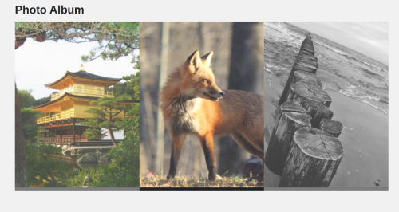

#  nodejs-photoalbum

> NodeJS Photo Album + Mongoose demo using Axios API and Pug template

In this example:

- The information about the photos is stored on MongoDB Atlas
- Index thumbnails are loaded via axios API
- Full photo view is rendered usion Pug template

## Screenshot

## > Run this code on

https://replit.com/@lugui20/nodejs-photoalbum

